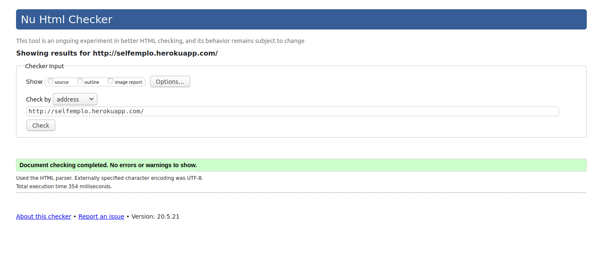
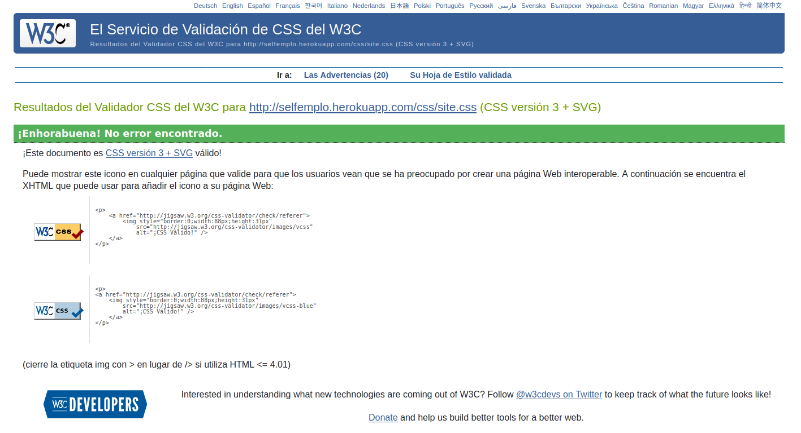
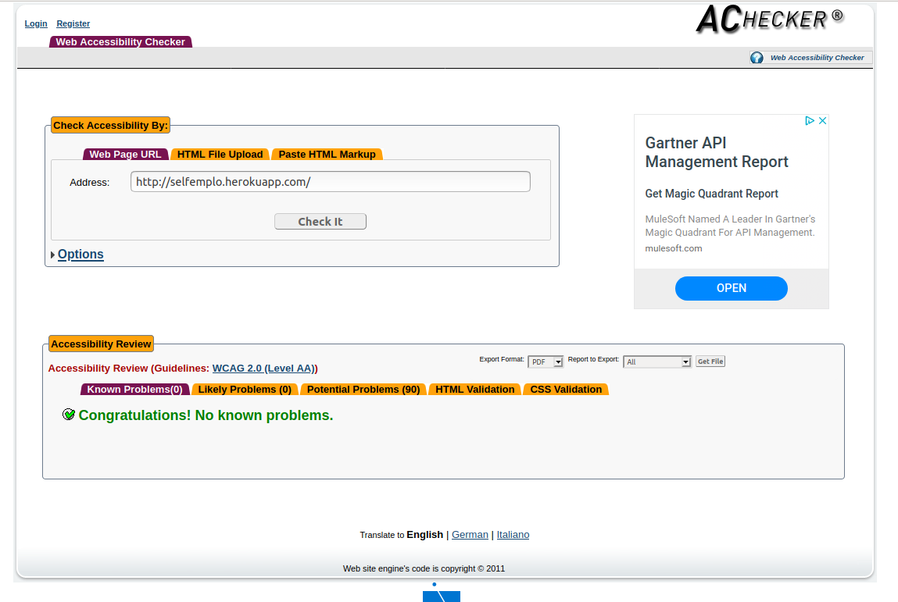
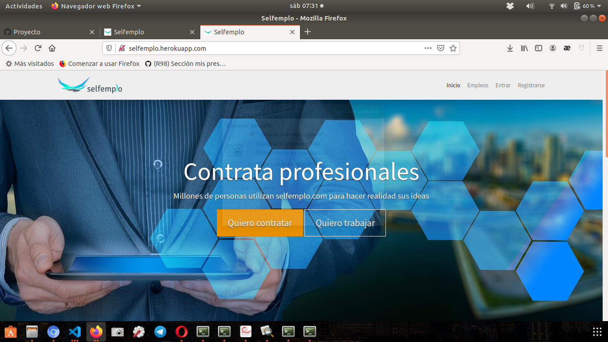
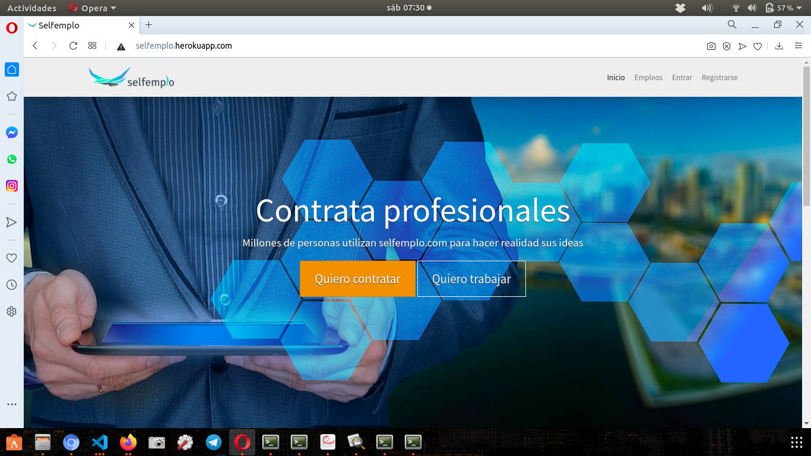

# Anexos

### **([R34](https://github.com/jujerez/selfemplo/issues/34)) Validación HTML5, CSS3 y accesibilidad**
---
### Validación de HTML y CSS

**HTML**

[Enlace validación HTML](https://validator.w3.org/nu/?doc=http%3A%2F%2Fselfemplo.herokuapp.com%2F)

**CSS**

[Enlace validación CSS](https://jigsaw.w3.org/css-validator/validator?uri=http%3A%2F%2Fselfemplo.herokuapp.com%2Fcss%2Fsite.css&profile=css3svg&usermedium=all&warning=1&vextwarning=&lang=es)

**Accesibilidad**

[Enlace validación accesibilidad](https://achecker.ca/checker/index.php)

### Prueba del seis

 1. ¿Qué sitio es éste?
- La aplicación tiene en todo momento elementos indicativos de que sitio es. Arriba en la menú de navegación está en todo momento el logotipo de la aplicación. Abajo en el pié de página. El menú de navegación y el pié de página se mantienen siempre, por lo que siempre está identificado el sitio.

 2. ¿En qué página estoy?
- Todas las páginas del sitio están identificadas por las migas de pan (excepto la inicial), lo que te sitúan en todo momento.

 3. ¿Cuales son las principales secciones del sitio?
- Las principales secciones del sitio son *Inicio*, *Empleos*, *Valoraciones* y *Mi perfil* 

 4. ¿Qué opciones tengo en este nivel?
- La navegación de cada nivel se realiza mediante botones y enlaces para hacer uso de las diferentes acciones y pantallas.

 5. ¿Dónde estoy en el esquema de las cosas?
- En todas las páginas existe en la zona superior un indicador de bloque con las migas de pan.

 6. ¿Cómo busco algo?
- La sección *Empleos*, cuenta con una sección para buscar un empleo de diferentes maneras.

---

### **([R36](https://github.com/jujerez/selfemplo/issues/36)) Varios navegadores**

#### **Google Chrome**

---

#### **Mozilla Firefox**

---

#### **Opera**

---

#### **Microsoft Edge**

---

### **([R25](https://github.com/jujerez/selfemplo/issues/25)) Codeception**

