# Manual de usuario

### Página de inicio (sin iniciar sesión)
La página de inicio tiene una cabecera con el logotipo a la izquierda y un menu de opciones a la derecha,
un cuerpo donde se explica brevemente como funcionalidad de la aplicación con los pasos a seguir y un pie de página.

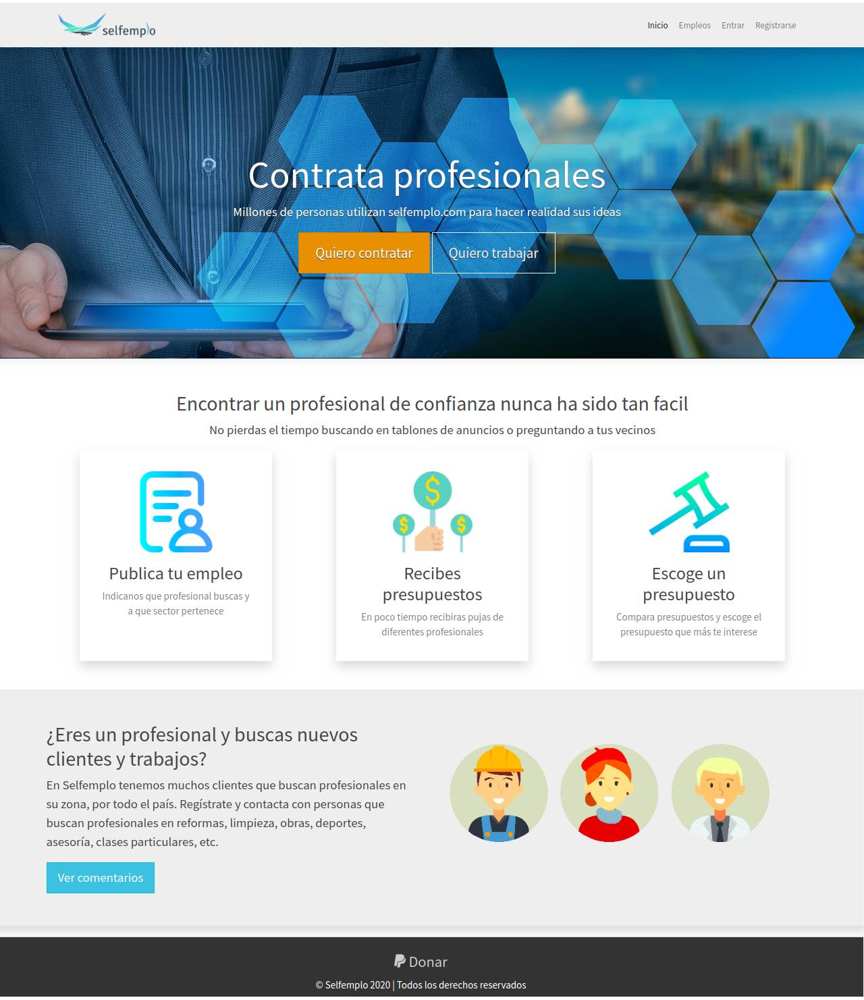

***

### Página de inicio (sesión iniciada)
Una vez loguado en el menu desaparece los enlaces "Entrar", "Regitrarse" y aparece un botón desplegable "Mi perfil" donde se muestran las diferentes opciones.

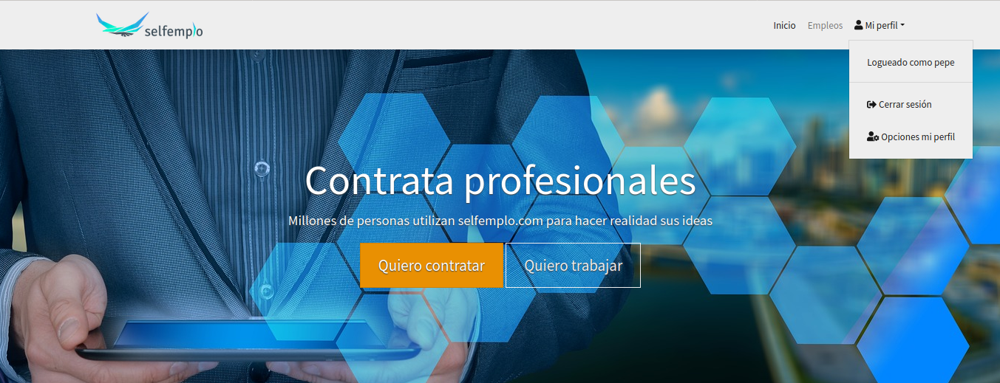

***

### Página de Logueo
Esta página muestra un formulario de acceso a usuarios registrados

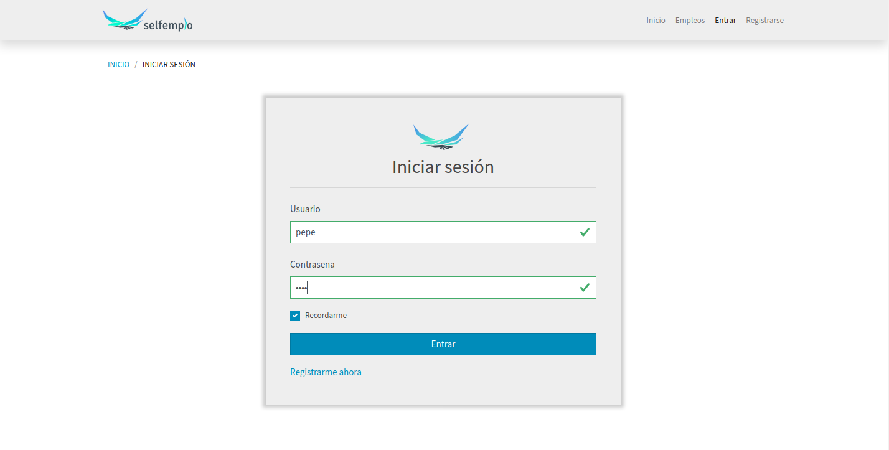

***

## Página de Empleos
Aquí podremos ver un listado con todos los empleos. 
Se puede buscar por:
* El título del empleo.
* Descripción del empleo.
* Fecha de publicación del empleo.
* La población donde se ubica el empleo.
* Provincia donde se ubica el empleo.
* Autor de la publicación.
* Sector profesional al que pertenece el empleo.
* Profesión del empleo solicitado.

Se puede ordenar por:
* Tiulos alfabeticamente.
* Sectores alfabeticamente.
* Por fecha de publicación.
* Por Provicias alfabeticamente.

En la tarjeta de empleo se puede ver:

* La profesión solicitada.
* El sector profesional al que pertenece
* Título del empleo.
* Descripción del empleo.
* Ubicación del empleo.
* Botones para compartir en redes sociales.
* La media aritmetica del valor total de todos los presupuestos.
* El autor de la publicación.
* La fecha de publicación.

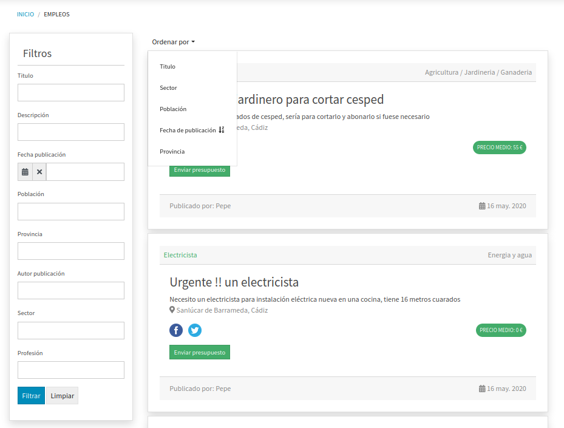

***

### Página  "Mi Perfil" usuario-empleador
Una vez loguado podemos acceder a la pagina perfil de usuario donde tendrá las siguientes opciones:
1. Modificar imagen de perfil.
2. Enlace para publicar un empleo.
3. Enlace para modificar su cuenta.
4. Eliminar su cuenta.
5. Ver los detalles de su perfil.
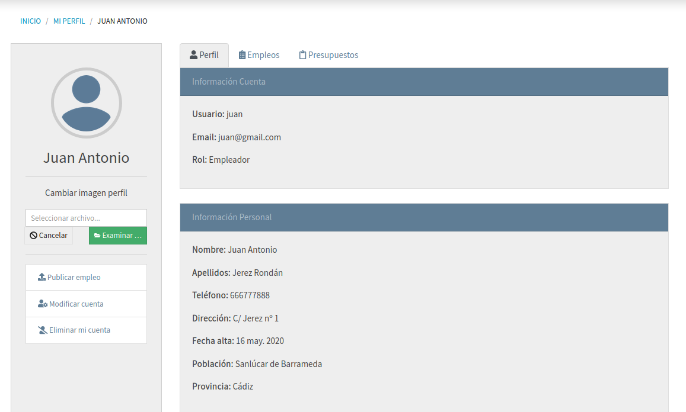
6. Ver los empleos publicados con acceso a modificación y eliminación del mismo.
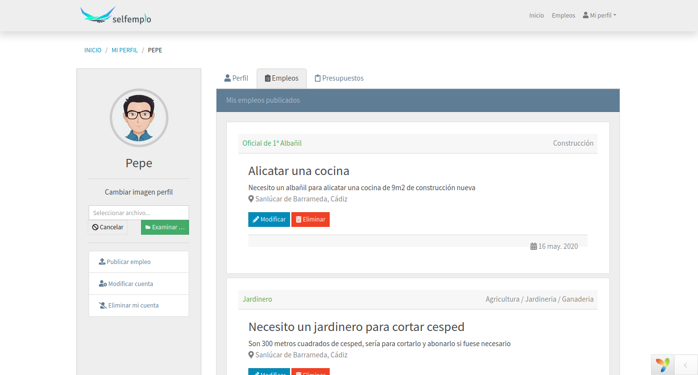
7. Presupuestos recibidos con el estado en el que se encuentra (Pendiente, Aceptado o Rechazado).
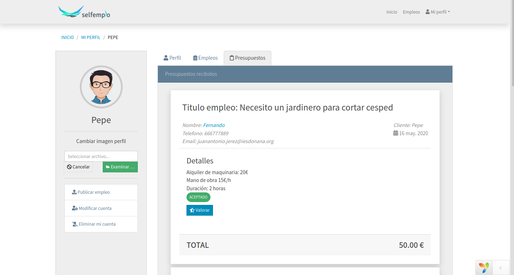
8. Botones para  aceptar o rechazar un presupuesto si el estado es pendiente.
9. Enlace para valorar un profesional si acepto el presupuesto.

***

### Página  "Mi Perfil" usuario-profesional
Una vez loguado podemos acceder a la pagina perfil de usuario donde tendrá las siguientes opciones:
1. Modificar imagen de perfil.
2. Enlace para modificar su cuenta.
3. Eliminar su cuenta.
4. Ver los detalles de su perfil.
5. Ver los presupuestos enviados con acceso a modificarlo o elimanarlo dependiendo del estado en el que se encuentre, no se puede modificar ni eliminar si ya ha sido aceptado.
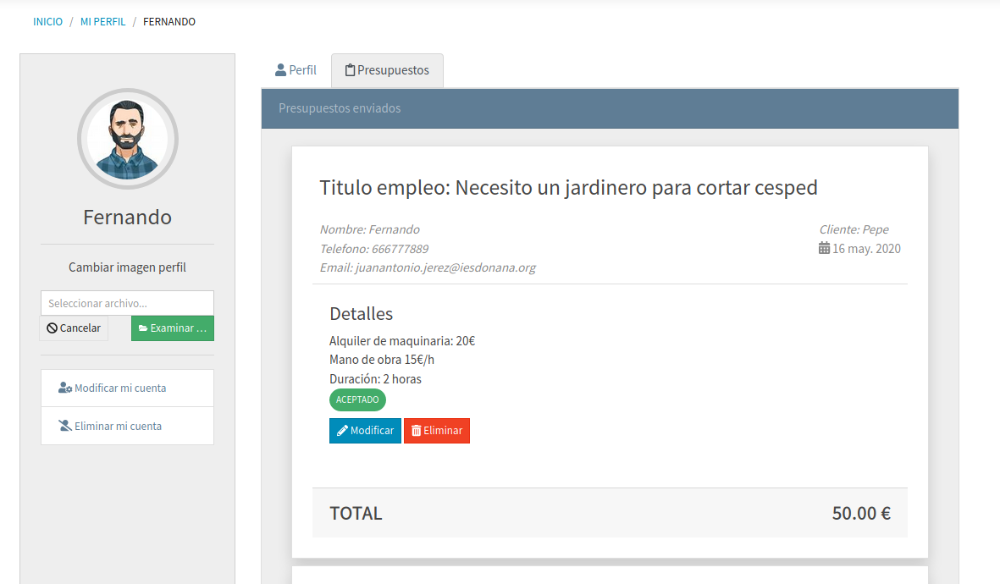

***

### Página  "Mi Perfil" usuario-administrador
Una vez loguado podemos acceder a la pagina perfil de usuario donde tendrá las siguientes opciones:
1. Modificar imagen de perfil.
2. Enlace para modificar su cuenta.
3. Eliminar su cuenta.
4. Ver los detalles de su perfil.
5. Ver los sectores profesionales con acceso para crear modificar y eliminar.
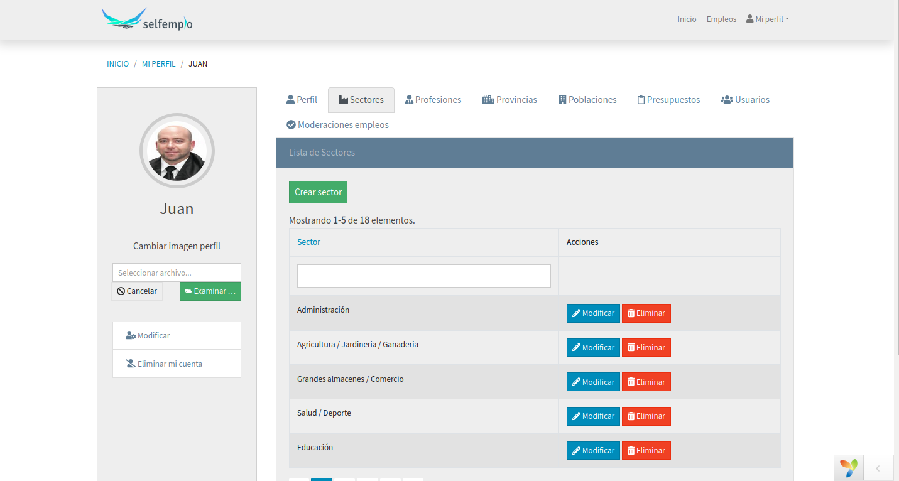
6. Ver las profesiones con acceso para crear modificar y eliminar.
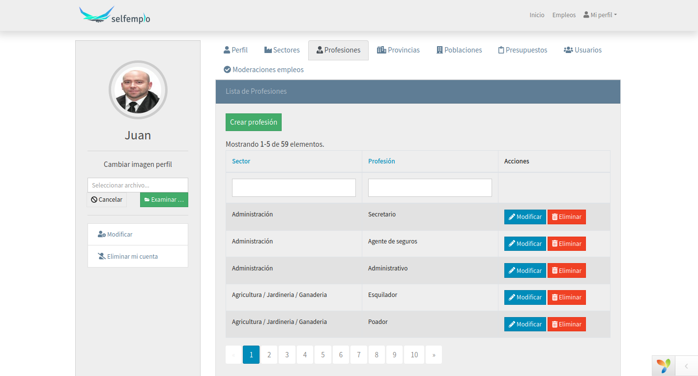
7. Ver las provincias con acceso para crear modificar y eliminar.
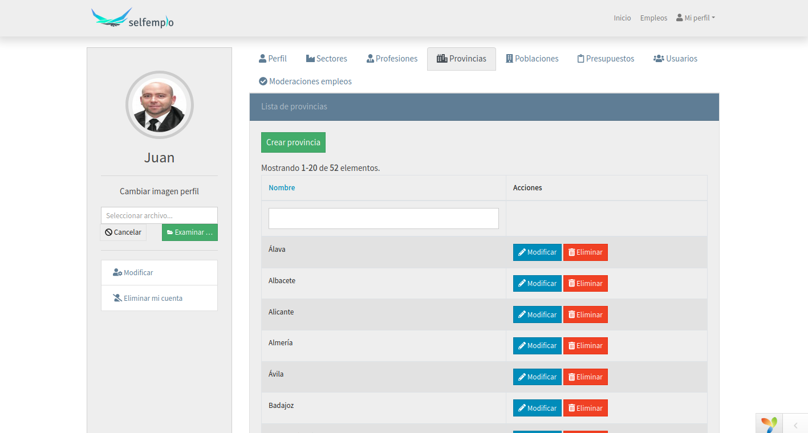
8. Ver las poblaciones con acceso para crear modificar y eliminar.
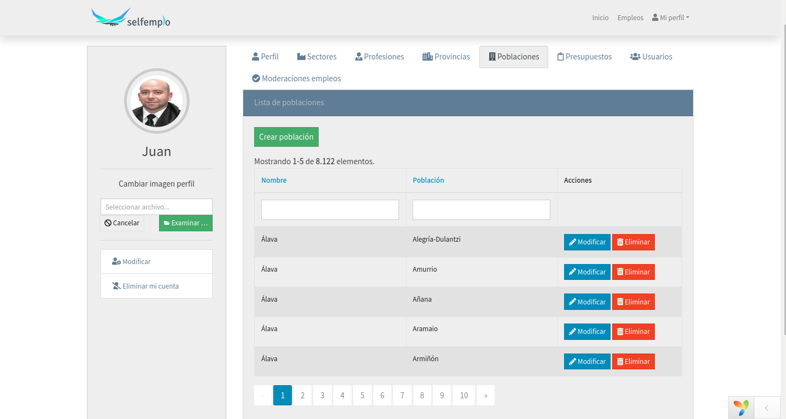
9. Ver los presupuestos con acceso para crear modificar y eliminar.
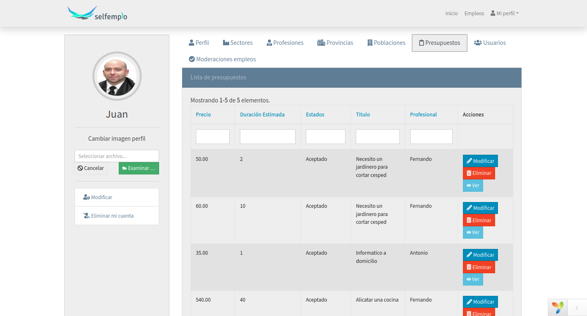
10. Ver la lista de usuarios registrador con boton para banear o desbanear.
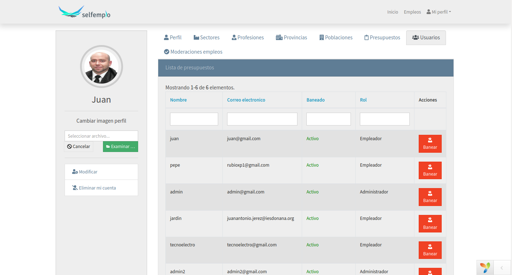
11. Ver lista de empleos con opciónes para moderar o eliminar.

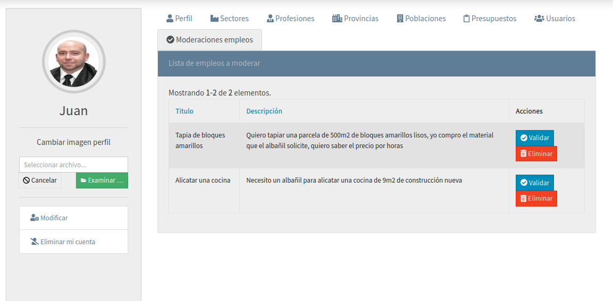

***

### Página de perfil público de profesionales
Esta página muestra la imagen de perfil del usuario, la valoración media, la descripción del usuario y un mapa que muestra su zona de trabajo. 

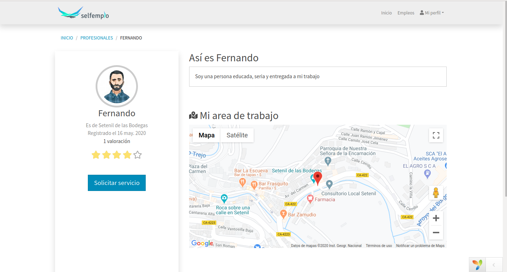

***

### Página de Valoraciones
Esta página muestran todas las valoraciones (comentario y puntuación) de los usuarios-profesionales. 

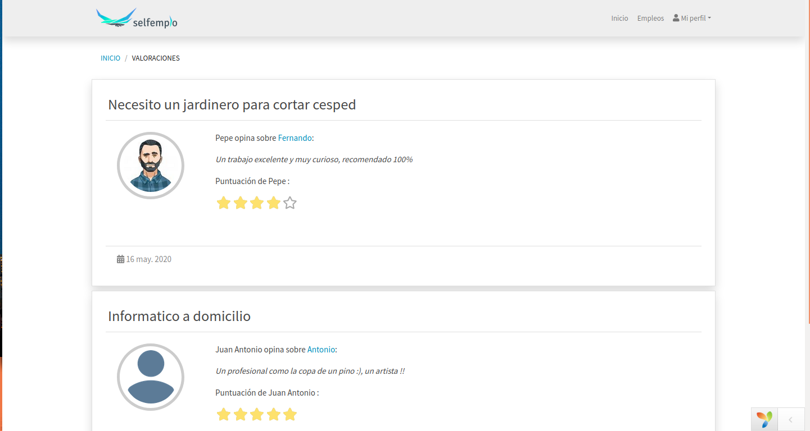

***

### Página para crear una valoración 
Aquí podemos crear una valoración, este página es solo accesible para los usuarios-empleadores que aceptan un presupuesto.

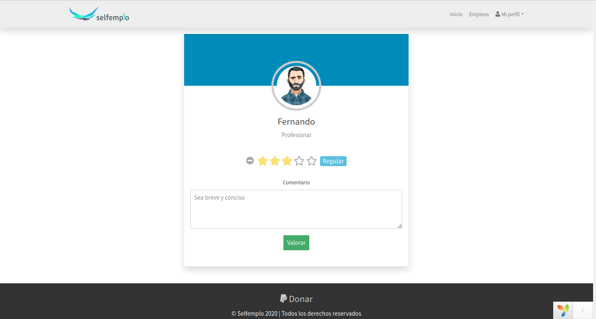

***

### Página para crear un empleo
Esta página es solo accesible para los usuarios-empleadores y consiste en rellenar un formulario

***
o
### Página para crear un presupuesto
Esta página es solo accesible para los usuarios-profesionales y solo hay que rellenar el formulario.

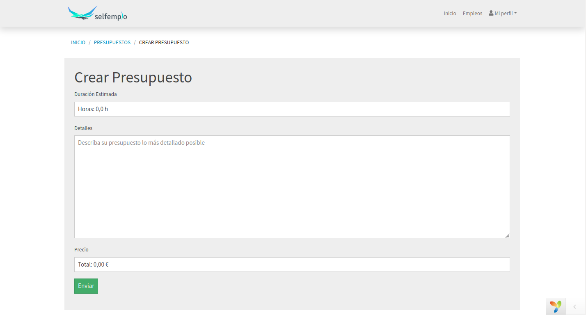

***

### Página para hacer una donación
Esta página es solo accesible para los usuarios-profesionales y solo hay que rellenar el formulario.

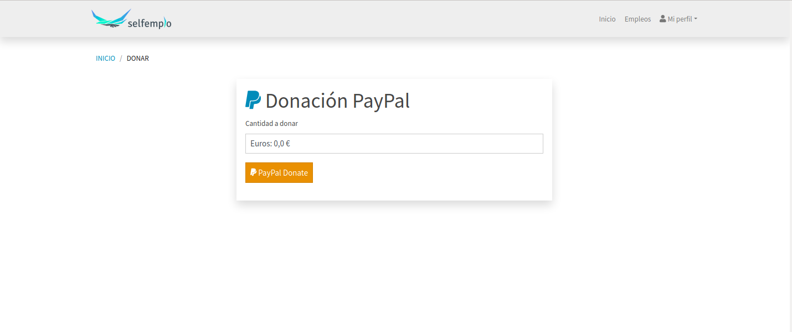

***

